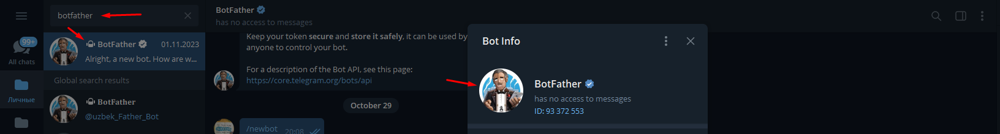
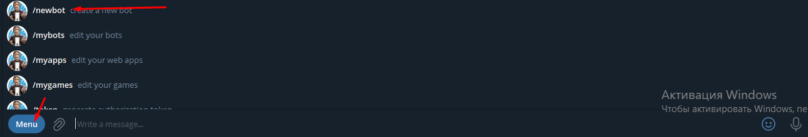
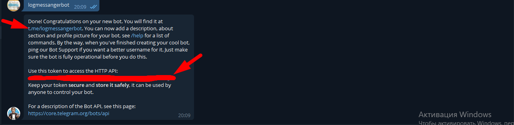
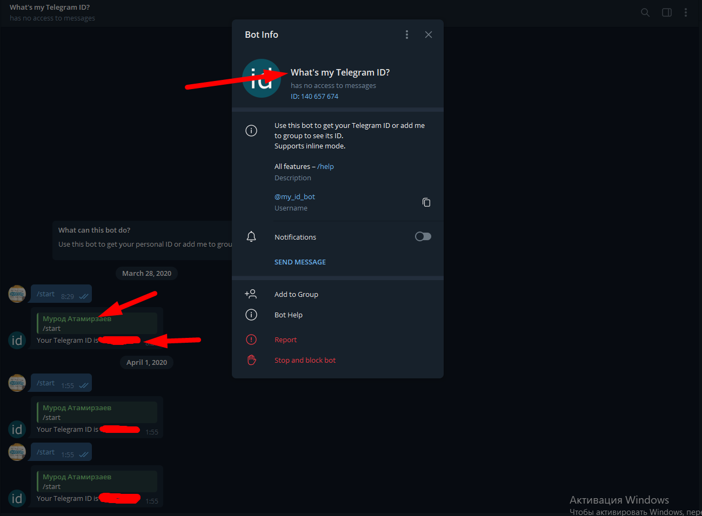
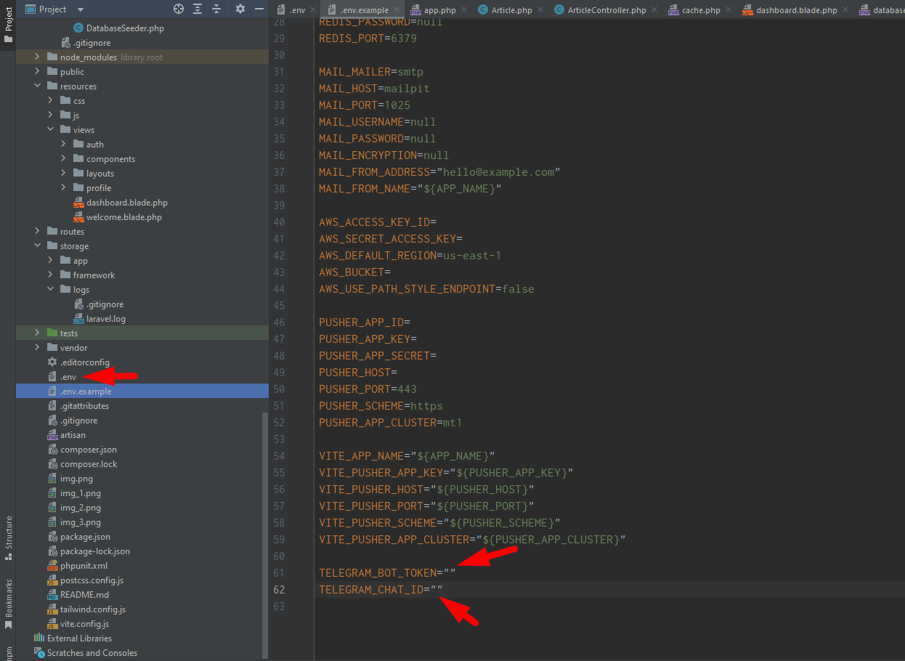

<p align="center"><a href="https://laravel.com" target="_blank"></a></p>

<p align="center">
<a href="https://github.com/laravel/framework/actions"></a>
<a href="https://packagist.org/packages/laravel/framework"></a>
<a href="https://packagist.org/packages/laravel/framework"></a>
<a href="https://packagist.org/packages/laravel/framework"></a>
</p>

## About Project

### Requirements

1. PHP 8.1
2. MYSQL 8.0.30
3. Composer 2.4.1
4. Redis 5.0.7

### Installation

* Clone the repository

```
$ composer install
$ cp .env.example .env
$ php artisan key:generate
$ php artisan jwt:secret
$ php artisan migrate
$ php artisan db:seed
$ php artisan serve
$ npm install && npm run dev
```
* Go [localhost:8000](http://localhost:8000)

### Packages

1. [Laravel Fortify](https://laravel.com/docs/10.x/fortify#password-confirmation)
2. [Laravel OpenAPI](https://vyuldashev.github.io/laravel-openapi)
3. [Swagger UI](https://swagger.io/tools/swagger-ui)
4. [Laravel Telescope](https://laravel.com/docs/telescope)
5. [JWT Auth](https://laravel-jwt-auth.readthedocs.io/en/latest/laravel-installation)
6. [Laravel Route Attribute](https://www.larablocks.com/package/spatie/laravel-route-attributes)
7. [Redis (Predis Package)](https://laravel.com/docs/10.x/redis#introduction)

### Use the app in your mobile phone to authenticate via one of the two apps below
1. [Google Authenticator for android](https://play.google.com/store/apps/details?id=com.google.android.apps.authenticator2&hl=ru&gl=US)
2. [Google Authenticator for ios](https://apps.apple.com/ru/app/google-authenticator/id388497605)

#### Used Mailpit for "forgot password" link 

### How to create a bot
* Open tg and search `BotFathe`, it looks like the picture below 

* Give a name for your bot

* At the end you will get a message, in which there is info

* How to get chat id

* Take the token and past the token and chat_id to .env file of the project


### I hope you will get it !
